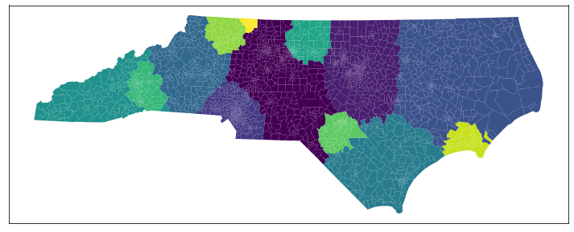

# Developing Weighted K-Means algorithm for Redistricting North Carolina

Developing an unsupervised ML method for drawing the voting districts in North Carolina. 

**Algorithm**

The original Weighted K-Means algorithm has been proposed by Guest et al. (2019) and the original paper can be found here: https://link.springer.com/article/10.1007/s42001-019-00053-9

I extend the method by weighting the distances not only by population but also by racial and partisan differences. Moreover, I open-source my code in hopes to continue the conversation about computational redistricting. 

**Data**

Some info here

**Demonstration**
`weighted_kmeans.py` is a Python script that implements the Weighted K-means from scratch.

A demonstration of how to use the method can be found in `demo_weighted_kmeans.ipynb`. The notebook also includes visualizations of the proposed maps for 2016 as well as the projected maps in 2030 and 2050 based on XXX. 
